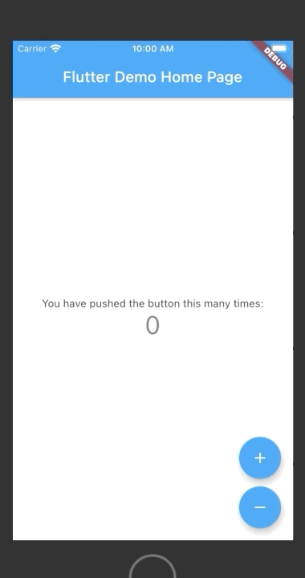

# Flutter Bloc Counter

Using BLoC pattern, there is two options :
1. HomePageBlocProvider : BlocProvider passed in Stateless widget, BlocBuilder and BlocProvider.of<CounterBloc>(context).add
2. HomePageVarBloc : variable _bloc passed in Statefull widget,  BlocBuilder/cubit and _bloc.add

These two options use the same code inside lib/bloc/counter

https://bloclibrary.dev/#/gettingstarted

https://pub.dev/packages/flutter_bloc

Course on Udemy 
https://www.udemy.com/course/flutter-firebase-build-a-complete-app-for-ios-android/learn/lecture/14609420#overview

